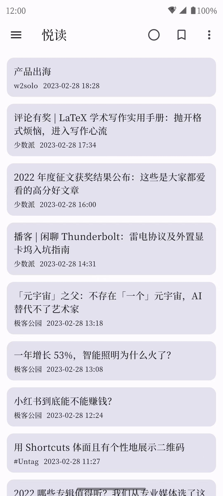
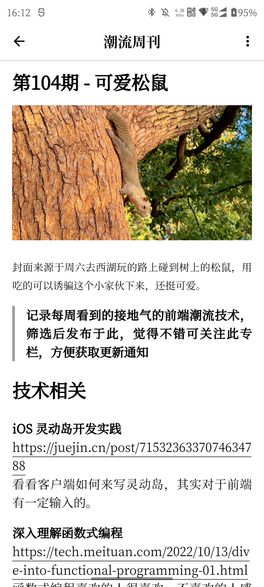
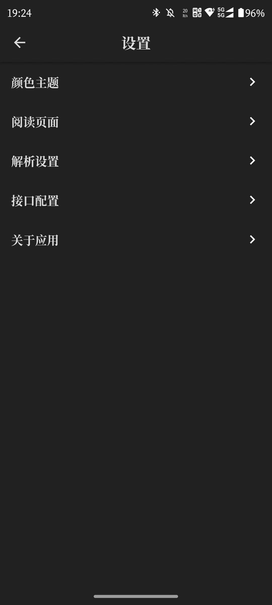
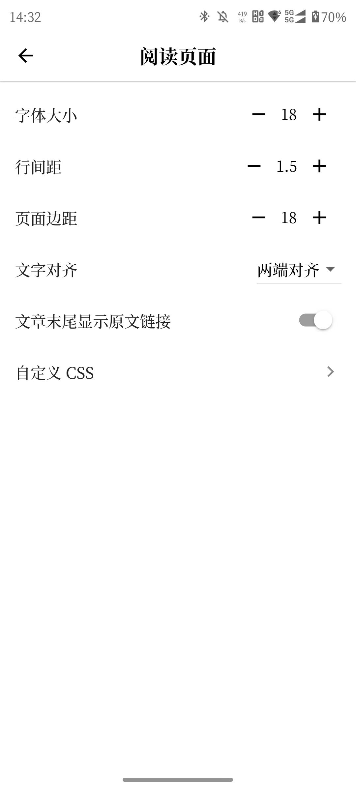

<h1>MeRead - 悦读</h1>

<strong>简洁、易用的 Feed 阅读器，使用 <a href='https://flutter.dev' target='_blank'>Flutter</a> 构建</strong>

## 说明

- [x] 支持 RSS、Atom 格式
- [x] 导入和导出 OPML
- [x] 获取全文
- [x] 自定义字体大小、行间距、页面边距、文字对齐
- [x] 自定义 CSS
- [x] 三种阅读模式：阅读器、应用内标签页、系统浏览器
- [x] 未读筛选、文章收藏、订阅源分组
- [x] 适配深色模式
- [ ] 多语言支持

## License

[GNU GPL-3.0](./LICENSE)
