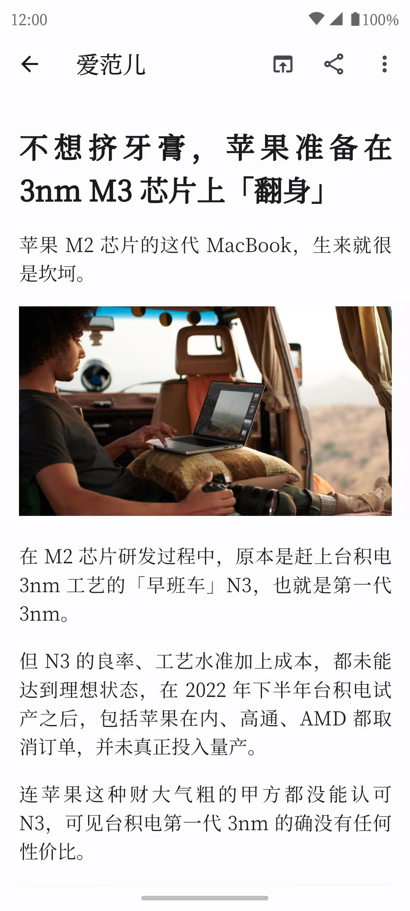
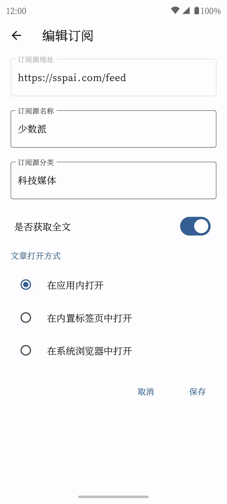
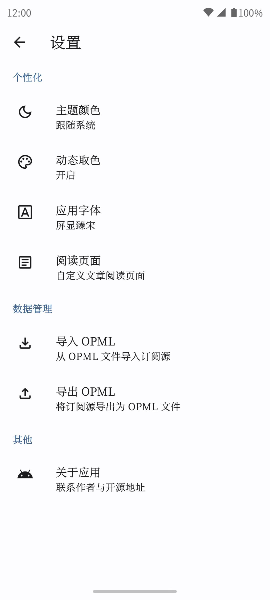

<h1>MeRead - 悦读</h1>

<strong>简洁、易用的 Feed 阅读器，使用 <a href='https://flutter.dev' target='_blank'>Flutter</a> 构建和 <a href='https://m3.material.io/' target='_blank'>Material You</a> 设计</strong>

## 说明

- [x] 通过导入和导出 OPML 迁移订阅源
- [x] 自动获取全文
- [x] 三种阅读模式：阅读器、应用内标签页、系统浏览器
- [x] 支持未读筛选、文章收藏、订阅源分组
- [x] 自定义全局字体
- [x] 自定义阅读页面字体大小、行间距、页面边距、文字对齐、CSS
- [x] 适配深色模式
- [x] 适配 Material You，支持壁纸动态取色
- [ ] 多语言支持

## 致谢

MeRead 在功能和设计上参考了开源项目 [spacecowboy/Feeder](https://gitlab.com/spacecowboy/Feeder) ，在此表示感谢。

## License

[GNU GPL-3.0](./LICENSE)
