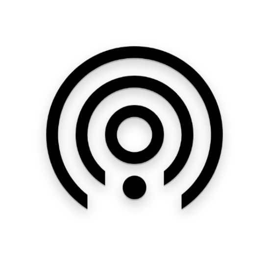
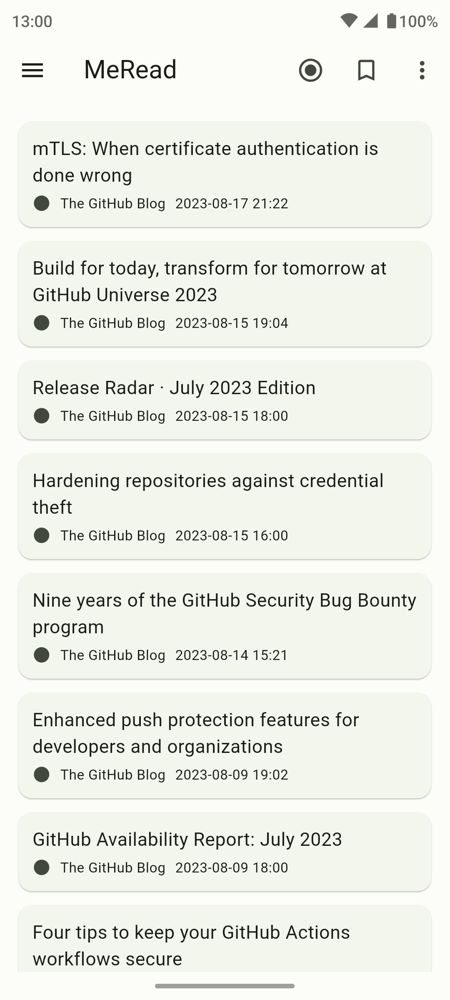
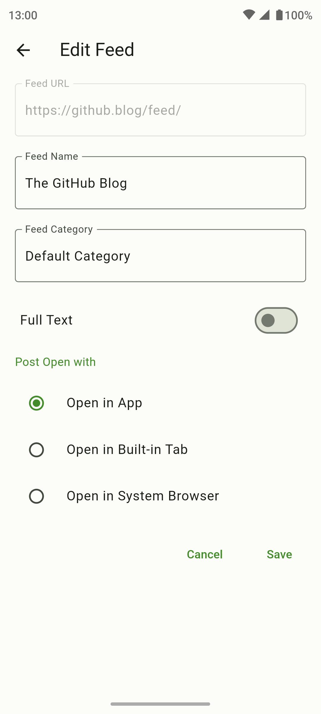
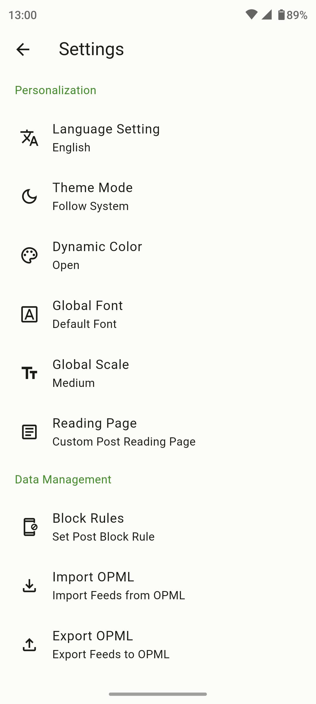

English | <a href="README_zh.md">简体中文</a>

<h1>MeRead</h1>

<strong>A concise and easy-to-use feed reader built using <a href='https://flutter.dev' target='_blank'>Flutter</a> and designed with <a href='https://m3.material.io/' target='_blank'>Material You</a></strong>

## Explain

- [x] Migrate feeds by importing and exporting OPML.
- [x] 自 Automatically obtain full text.
- [x] Three reading modes: reader, in app tab, and system browser.
- [x] Supports unread filtering, article favorites, and feed grouping.
- [x] Block articles through keywords.
- [x] Customize global fonts and global scaling.
- [x] Custom reading page font size, line spacing, page margins, text alignment, CSS.
- [x] Adapt to dark mode.
- [x] Adapt to Material You and support dynamic color.
- [x] Multi language support.

## Thanks

MeRead references the open source project [spacecowboy/feeder](https://gitlab.com/spacecowboy/Feeder) in terms of functionality and design. Thank you here.

## License

[GNU GPL-3.0](./LICENSE)
